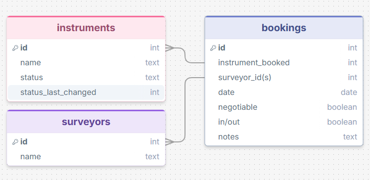
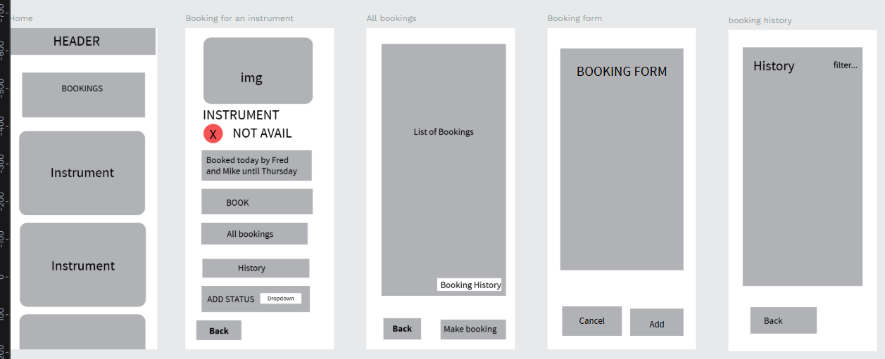
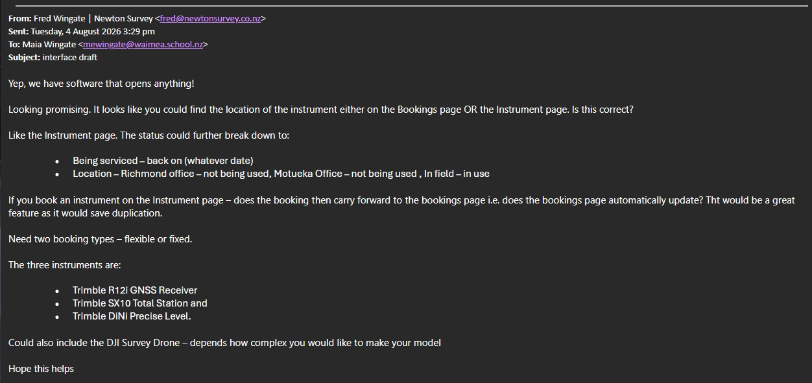
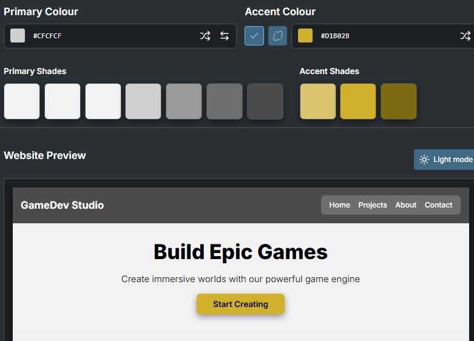
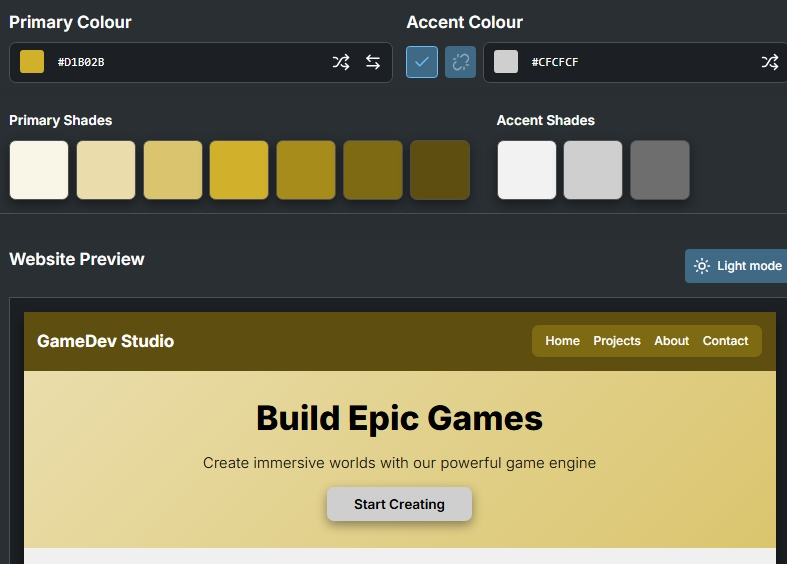
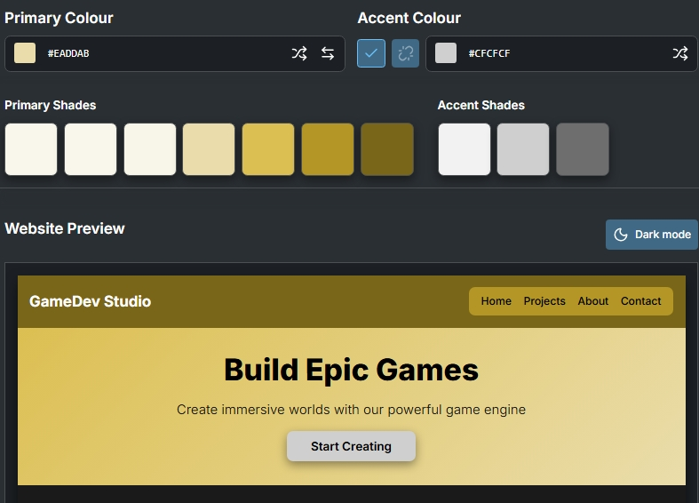
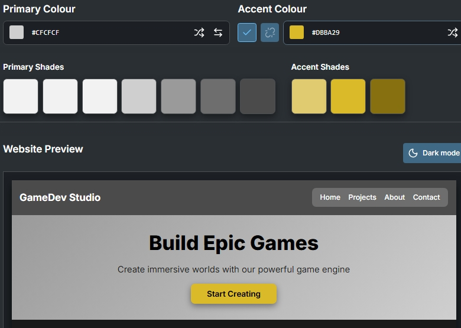
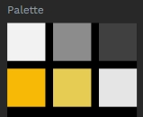

# Sprint 1 - Developing a DB and UI Prototype

## Sprint Goals

- Develop a design for the database and a UI prototype that simulates the key functionality of the system. 
- Test and refine the UI so that it can serve as the model for the next phase of development in Sprint 2.

### Specific Goals

- Design the database:
    - Tables
    - Fields / types
    - Primary keys
    - Nullable values
    - Relationships (foreign keys)
- Design the UI
    - Key pages
    - User interactions and 'flow'
    - Page layouts / features
    - Colour palette
    - Etc.

## Initial Database Design

I have created a schema for the DB that I will talk through with my end-user. It has tables for: 
- **the surveyors** (my end-users)
- **the instruments** to be used on jobs and: 
    - their status (dirty etc),
    - the time the status was last modified, 
    - the instrument name.
- **bookings**: 
    - the id, 
    - instrument booked, 
    - surveyor(s) booking the instrument, 
    - the date, 
    - whether the booking is flexible,
    - a check in/out for the instrument, 
    - and any notes. 

### Required Data Input

Data to be input:

**Initially:**
- Surveyor data (names)
- Instrument data
    - name
    - status
    - status changelog

**Then:**
- instrument to be booked
- surveyors requesting instrument
- date
- flexibility of date
- check in/out
- notes.

### Required Data Output

Users will be able to see:
- **Instrument data**
- **Booking list** - filter by date/instrument/surveyor/negotiable and be able to see history as well
- (Ask end-user) Noticeboard for requesting booking dates?
**UPDATE** End-user says possibly. Keep as optional

## Update
I had a meeting with my end-user and showed him my DB design. He confirmed that instruments would be booked for multiple days and responded as "possibly" for a notices screen.

## UI 'Flow'

This is my first go at designing the pages for my system:

**https://design.penpot.app/#/view?file-id=ddb7145f-a1be-80bb-8008-6c683cf92e39&page-id=ddb7145f-a1be-80bb-8008-6c683cf92e3a&section=interactions&index=0&share-id=6f06cb60-262a-804c-8008-6c702ed9e385**

### Testing

I gave my flow template to my dad to test and he gave me the OK to continue with it- he is happy with the initial design, especially the instrument page. He also gave me some more info that I can use when designing my system in an email:

He also told me *"Don't need any more pages- less is always better."*

## Initial UI Prototype

The next stage of prototyping was to develop the layout for each screen of the UI.
I did add some colours etc to figure out how some of it might go before sending the whole thing to my dad for feedback 
**NOTE** Only the first two pages are changed from the flow prototype and the only instrument link that works from the home page is the 12i, everything else is the same. This is to avoid going off-track in between feedback runs. 
https://design.penpot.app/#/view?file-id=3be9e5e1-190f-8090-8008-7056285fd675&page-id=ddb7145f-a1be-80bb-8008-6c683cf92e3a&section=interactions&frame-id=d6288cb9-2f05-80f4-8008-6c684f808492&index=0&share-id=81f57451-85cc-819d-8008-71cb68118f68

### Testing

Replace this text with notes about what you did to test the UI flow and the outcome of the testing.

### Changes / Improvements

Replace this text with notes any improvements you made as a result of the testing.

*FIGMA IMPROVED PROTOTYPE - PLACE THE FIGMA EMBED CODE HERE - MAKE SURE IT IS SET SO THAT EVERYONE CAN ACCESS IT*

## Refined UI Prototype

Having established the layout of the UI screens, the prototype was refined visually, in terms of colour, fonts, etc.

I gave a few colour options to Dad as mockups on a dummy website:

### Changes / Improvements

Replace this text with notes any improvements you made as a result of the testing.

*FIGMA IMPROVED REFINED PROTOTYPE - PLACE THE FIGMA EMBED CODE HERE - MAKE SURE IT IS SET SO THAT EVERYONE CAN ACCESS IT*

## Sprint Review

Replace this text with a statement about how the sprint has moved the project forward - key success point, any things that didn't go so well, etc.

